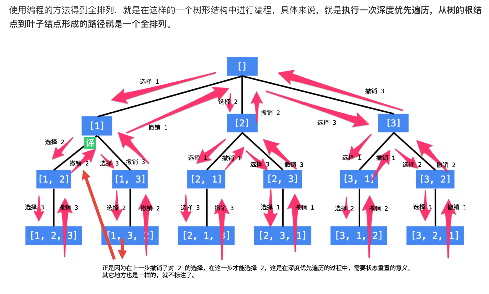

说明：

1、每一个结点表示了“全排列”问题求解的不同阶段，这些阶段通过变量的“不同的值”体现；
2、这些变量的不同的值，也称之为“状态”；
3、使用深度优先遍历有“回头”的过程，在“回头”以后，状态变量需要设置成为和先前一样；
4、因此在回到上一层结点的过程中，需要撤销上一次选择，这个操作也称之为“状态重置”；
5、深度优先遍历，可以直接借助系统栈空间，为我们保存所需要的状态变量，在编码中只需要注意遍历到相应的结点的时候，状态变量的值是正确的，具体的做法是：往下走一层的时候，path 变量在尾部追加，而往回走的时候，需要撤销上一次的选择，也是在尾部操作，因此 path 变量是一个栈。
6、深度优先遍历通过“回溯”操作，实现了全局使用一份状态变量的效果。

下面我们解释如何编码：

1、首先这棵树除了根结点和叶子结点以外，每一个结点做的事情其实是一样的，即在已经选了一些数的前提，我们需要在剩下还没有选择的数中按照顺序依次选择一个数，这显然是一个递归结构；

2、递归的终止条件是，数已经选够了，因此我们需要一个变量来表示当前递归到第几层，我们把这个变量叫做 depth；

3、这些结点实际上表示了搜索（查找）全排列问题的不同阶段，为了区分这些不同阶段，我们就需要一些变量来记录为了得到一个全排列，程序进行到哪一步了，在这里我们需要两个变量：

（1）已经选了哪些数，到叶子结点时候，这些已经选择的数就构成了一个全排列；
（2）一个布尔数组 used，初始化的时候都为 false 表示这些数还没有被选择，当我们选定一个数的时候，就将这个数组的相应位置设置为 true ，这样在考虑下一个位置的时候，就能够以 O(1)O(1) 的时间复杂度判断这个数是否被选择过，这是一种“以空间换时间”的思想。

我们把这两个变量称之为“状态变量”，它们表示了我们在求解一个问题的时候所处的阶段。

4、在非叶子结点处，产生不同的分支，这一操作的语义是：在还未选择的数中依次选择一个元素作为下一个位置的元素，这显然得通过一个循环实现。

5、另外，因为是执行深度优先遍历，从较深层的结点返回到较浅层结点的时候，需要做“状态重置”，即“回到过去”、“恢复现场”，我们举一个例子。

从 [1, 2, 3] 到 [1, 3, 2] ，深度优先遍历是这样做的，从 [1, 2, 3] 回到 [1, 2] 的时候，需要撤销刚刚已经选择的数 3，因为在这一层只有一个数 3 我们已经尝试过了，因此程序回到上一层，需要撤销对 2 的选择，好让后面的程序知道，选择 3 了以后还能够选择 2。

这种在遍历的过程中，从深层结点回到浅层结点的过程中所做的操作就叫“回溯”。

作者：liweiwei1419
链接：https://leetcode-cn.com/problems/permutations/solution/hui-su-suan-fa-python-dai-ma-java-dai-ma-by-liweiw/
来源：力扣（LeetCode）
著作权归作者所有。商业转载请联系作者获得授权，非商业转载请注明出处。